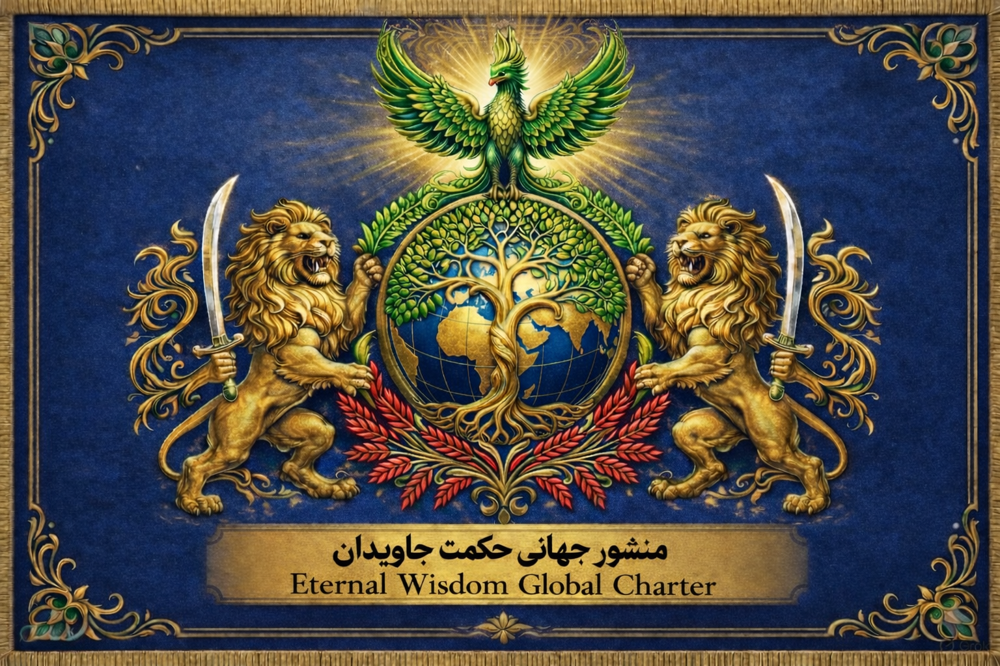

# ✨ WisdomPact

  

<h3 align="center">
Eternal Wisdom Global Charter
</h3>

A Universal Framework for Wisdom, Humanity, Knowledge and Future Civilization

🌍 Philosophy • 📜 Charter • 🤖 Technology • 🌱 Civilization

---

# 🌟 About WisdomPact

**WisdomPact (پیمان حکمت)** is a global open initiative based on the 
**Eternal Wisdom Global Charter (منشور جهانی حکمت جاویدان)**.

The mission of WisdomPact is to create a bridge between:

- Ancient wisdom and modern science
- Human values and emerging technologies
- Cultural diversity and universal principles
- Present civilization and future generations

---

# 📜 Eternal Wisdom Global Charter

The foundation of WisdomPact is the **Eternal Wisdom Global Charter**:

A universal philosophical and ethical framework designed to promote:

- Human dignity
- Justice and transparency
- Knowledge and education
- Environmental harmony
- Peaceful cooperation
- Responsible technology

Available versions:

| Language | Format |
|---|---|
| فارسی | PDF / DOCX |
| English | PDF / DOCX |

➡️ [Read the Charter](charter/)

---

# 🧭 Vision

To contribute toward a future civilization where:

> Wisdom guides knowledge,  
> knowledge guides technology,  
> and technology serves humanity.

---

# 🔱 Core Principles

## 1. Universal Wisdom

Recognizing wisdom as a shared heritage of humanity.

## 2. Human Dignity

Protecting the fundamental value of every human being.

## 3. Knowledge Freedom

Supporting open access to learning and research.

## 4. Sustainable Civilization

Creating harmony between humanity and Earth.

## 5. Ethical Technology

Developing technology aligned with human values.

---

# 🏛️ WisdomCore Ecosystem

WisdomPact is designed as a foundation for multiple future platforms:

## 🧠 WisdomAI

Artificial intelligence systems designed for knowledge integration and wisdom-based decision support.

## ⛓️ WisdomChain

A decentralized infrastructure for transparency, cooperation and digital civilization.

## 🌐 WisdomDAO

A community governance model based on participation and collective intelligence.

## 🏙️ WisdomLand

A future digital and physical ecosystem connecting education, culture, technology and innovation.

## 📚 WisdomLibrary

An open global knowledge archive.

---

# 🏗️ Repository Structure
